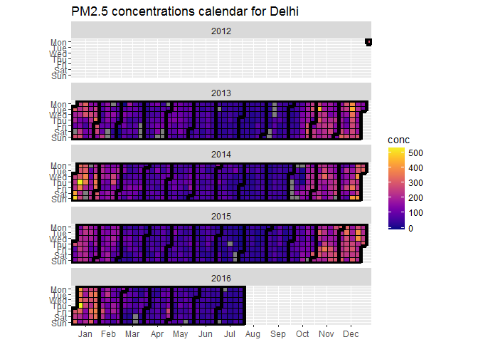

-   [Introduction to the data and the repo](#introduction-to-the-data-and-the-repo)
-   [R package](#r-package)
-   [Data format](#data-format)
-   [Time series plot](#time-series-plot)
-   [Calendar plot](#calendar-plot)
-   [Contributing](#contributing)

[](https://travis-ci.org/masalmon/usaqmindia) [](https://ci.appveyor.com/project/masalmon/usaqmindia) [](https://codecov.io/github/masalmon/usaqmindia?branch=master)

Introduction to the data and the repo
=====================================

The U.S. Embassy and Consulates General in India maintain an air quality monitoring program with on-site measuring instruments and put the corresponding data [on this website](http://newdelhi.usembassy.gov/airqualitydata.html). There are csv files for 2013 and 2014, for 2015 except December which is in a pdf, and various csv/pdf for the months of the beginning of 2016. From August 2016 I chose to use OpenAQ and in particular [ropenaq](https://github.com/ropenscilabs/ropenaq) to get new data.

In this repository I have made a copy of these files and provide a R code for wrangling them to get a single csv with all measures for Delhi, Mumbai, Kolkata, Hyderabad and Chennai. Refer to original source for licensing questions.

*Useful even for non R users: You will find the raw data [in this folder](inst/extdata) and my wrangling code is [here](inst/pm25_consulate.R). The resulting csv is [here](inst/pm25USA.csv). I will try to update the repository as new data comes in on the embassy website.*

R package
=========

I have made a R package out of the data so that my fellow R users can easily play with the data. The package imports [`ggTimeSeries`](https://github.com/Ather-Energy/ggTimeSeries) for doing the calendar plot. It can be installed this way:

``` r
devtools::install_github("Ather-Energy/ggTimeSeries")
devtools::install_github("masalmon/usaqmindia")
```

Data format
===========

The data is in a long format:

``` r
library("usaqmindia")
library("dplyr")
data("pm25_india")
pm25_india %>% head(n = 20) %>% knitr::kable()
```

| datetime            | city  |   conc|
|:--------------------|:------|------:|
| 2013-01-01 01:00:00 | Delhi |  324.4|
| 2013-01-01 02:00:00 | Delhi |  366.8|
| 2013-01-01 03:00:00 | Delhi |  290.7|
| 2013-01-01 04:00:00 | Delhi |  245.4|
| 2013-01-01 05:00:00 | Delhi |  220.3|
| 2013-01-01 06:00:00 | Delhi |  180.2|
| 2013-01-01 07:00:00 | Delhi |  140.0|
| 2013-01-01 08:00:00 | Delhi |  125.0|
| 2013-01-01 09:00:00 | Delhi |  111.0|
| 2013-01-01 10:00:00 | Delhi |  112.0|
| 2013-01-01 11:00:00 | Delhi |  129.4|
| 2013-01-01 12:00:00 | Delhi |  184.1|
| 2013-01-01 13:00:00 | Delhi |  284.8|
| 2013-01-01 14:00:00 | Delhi |  372.3|
| 2013-01-01 15:00:00 | Delhi |  456.7|
| 2013-01-01 16:00:00 | Delhi |  404.8|
| 2013-01-01 17:00:00 | Delhi |  328.1|
| 2013-01-01 18:00:00 | Delhi |  274.4|
| 2013-01-01 19:00:00 | Delhi |  285.0|
| 2013-01-01 20:00:00 | Delhi |  354.9|

Time series plot
================

Below is an example plot of concentrations (see the code [here](R/redo_plot.R)). Check out the Diwali peaks!

``` r
library("usaqmindia")
usaqmindia_plot()
```


Calendar plot
=============

And this is a calendar plot of daily median concentrations in one city using the [`ggTimeSeries`](https://github.com/Ather-Energy/ggTimeSeries) package (see the code [here](R/calendar.R)):

``` r
usaqmindia_calendar(cityplot = "Delhi")
```



Contributing
============

Please note that this project is released with a [Contributor Code of Conduct](CONDUCT.md). By participating in this project you agree to abide by its terms.
